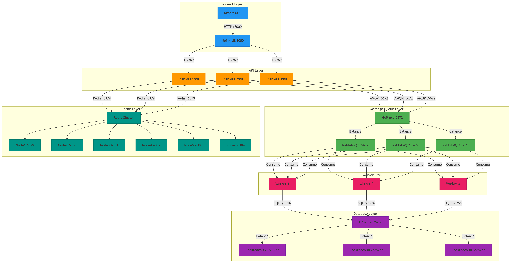
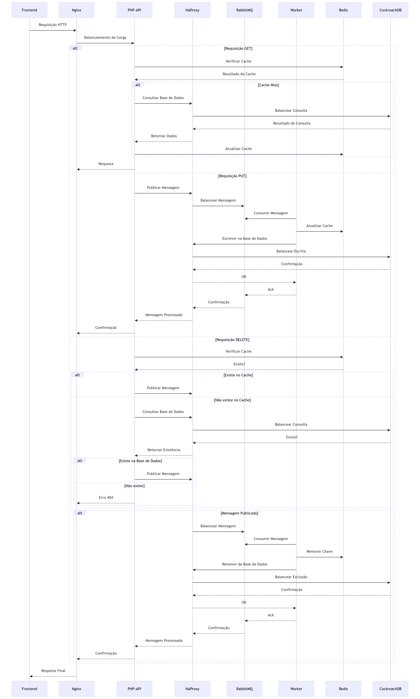

<div id="top">

<!-- HEADER STYLE: CLASSIC -->
<div align="center">


# ATIVIDADE2

<em>Potencie as suas aplicações com soluções escaláveis e integradas.</em>
<em>Construído com as seguintes ferramentas e tecnologias:</em>


<br>


</div>
<br>

---

## 📄 Índice

- [Demo do Sistema](#demo-do-sistema)
- [Visão Geral](#-visão-geral)
- [Qualidades do Sistema Distribuído](#-qualidades-do-sistema-distribuído)
- [Decisões Arquiteturais Estratégicas](#️-decisões-arquiteturais-estratégicas)
- [Arquitetura do Sistema](#-arquitetura-do-sistema)
- [Fluxo do Sistema](#-fluxo-do-sistema)
- [Manual da API](#-manual-da-api)
- [Primeiros Passos](#-primeiros-passos)
    - [Pré-requisitos](#-pré-requisitos)
    - [Instalação](#️-instalação)
    - [Utilização](#-utilização)
- [Demo de Instalação](#demo-de-instalação)
- [Estrutura do Projeto](#-estrutura-do-projeto)
    - [Índice do Projeto](#-índice-do-projeto)
- [Testes](#-testes)
    - [Resultados e Análise](#-resultados-e-análise)
- [Limites e Capacidades](#-limites-e-capacidades)
- [Contribuir](#-contribuir)
- [Agradecimentos](#-agradecimentos)
- [Bibliografia]

---
## 🎥 Demo do Sistema

## ✨ Visão Geral

Atividade2 é uma ferramenta poderosa para programadores, concebida para simplificar a implementação e gestão de aplicações baseadas em microserviços, garantindo alta disponibilidade e escalabilidade.

**Porquê usar o Atividade2?**

Este projeto simplifica a orquestração de ecossistemas de aplicações complexas. As funcionalidades principais incluem:

- 🚀 **Arquitetura de Microserviços:** Simplifica a implementação e escalabilidade de aplicações.
- ⚙️ **Configuração Automatizada:** Facilita a criação do ambiente de desenvolvimento com Docker Compose.
- 📊 **Scripts de Testes de Carga:** Garante o desempenho sob diferentes condições, identificando gargalos.
- 🔗 **Gestão Robusta de APIs:** Permite uma comunicação fluída entre os serviços de frontend e backend.
- 🛠️ **Monitorização de Saúde:** Verificações de integridade integradas aumentam a fiabilidade.
- 📈 **Relatórios Detalhados:** Gera relatórios de desempenho pormenorizados para suportar decisões informadas.

---

## 🌐 Qualidades do Sistema Distribuído

### **1. Consistência de Dados**
| Componente         | Contribuição                                                                 |
|---------------------|-----------------------------------------------------------------------------|
| **CockroachDB**     | Utiliza o algoritmo **Raft** para consenso distribuído, garantindo operações lineares e ACID mesmo durante partições de rede. |
| **Redis Cluster**   | Implementa o protocolo **CRDTs** (Conflict-free Replicated Data Types) para resolução automática de conflitos em escrita paralela. |
| **RabbitMQ Quórum** | Filas quórum com replicação síncrona asseguram entrega exatamente-uma (exactly-once) de mensagens. |

### **2. Tolerância a Falhas**
| Componente         | Mecanismo de Resiliência                                                    |
|---------------------|-----------------------------------------------------------------------------|
| **HAProxy**         | Health checks ativos + failover automático entre instâncias PHP-API e RabbitMQ. |
| **Redis Cluster**   | Réplicas shardadas com failover automático via algoritmo **Gossip**.        |
| **CockroachDB**     | Replicação multi-AZ com recuperação de nós em <30s usando **Range Leases**. |

### **3. Escalabilidade Horizontal**
| Componente         | Estratégia de Escalonamento                                                 |
|---------------------|-----------------------------------------------------------------------------|
| **PHP-API**         | Arquitetura stateless permite adição dinâmica de réplicas via Docker Swarm. |
| **Workers**         | Consumidores paralelos com auto-balancing via **Prefetch Count** no RabbitMQ. |
| **Nginx**           | Balanceamento Round-Robin + cache de respostas HTTP para descarregar a API. |

### **4. Alta Disponibilidade**
| Componente         | Técnica de Garantia                                                         |
|---------------------|-----------------------------------------------------------------------------|
| **CockroachDB**     | Replicação multi-região com eleição de líder via **Raft Leader Lease**.     |
| **RabbitMQ**        | Filas espelhadas (mirrored queues) com política quórum para alta durabilidade. |
| **HAProxy**         | Circuit breaking inteligente com re-tentativas em múltiplas camadas.       |

### **5. Coordenação de Recursos**
| Componente         | Protocolo/Mecanismo                                                         |
|---------------------|-----------------------------------------------------------------------------|
| **Redis**           | Lock distribuído via **RedLock** para operações atômicas entre workers.     |
| **CockroachDB**     | Sistema de transações distribuídas usando **Timestamp Oracle**.            |
| **PHP-API**         | Geração centralizada de UUIDs versionados para evitar colisões em inserts. |

---

## 🏗️ Decisões Arquiteturais Estratégicas

### **CockroachDB**
- **Por quê?** Resolve o problema de SPOF (Single Point of Failure) através de replicação automática
- **Contribuição para SD**:
  - **Consistência**: Modelo de relógio híbrido (Hybrid Logical Clocks)
  - **Tolerância**: Sobrevive a falhas de N/2-1 nós simultâneos
  - **Escala**: Adição transparente de novos nós ao cluster

### **Redis Cluster**
- **Por quê?** Oferece cache distribuído com consistência eventual controlada
- **Contribuição para SD**:
  - **Performance**: Reduz latência de leituras para <10ms
  - **Disponibilidade**: Re-sharding automático durante falhas
  - **Consistência**: Políticas TTL-driven para invalidação de cache

### **HAProxy**
- **Por quê?** Unifica o plano de controle para múltiplos serviços
- **Contribuição para SD**:
  - **Balanceamento**: Distribuição inteligente baseada em saúde dos nós
  - **Observabilidade**: Métricas em tempo real via endpoint /stats
  - **Segurança**: Rate limiting para prevenir DDoS

### **RabbitMQ com Quórum**
- **Por quê?** Garante durabilidade de mensagens em cenários de crash
- **Contribuição para SD**:
  - **Ordenação**: Garantia de entrega FIFO dentro do mesmo canal
  - **Durabilidade**: Replicação síncrona para ≥(N/2+1) nós
  - **Eficiência**: Prefetching otimizado para workers paralelos

### **PHP-API (Stateless)**
- **Por quê?** Permite escalonamento horizontal sem coordenação complexa
- **Contribuição para SD**:
  - **Elasticidade**: Pods efêmeros escaláveis sob demanda
  - **Resiliência**: Reinicialização rápida sem perda de estado
  - **Portabilidade**: Imagem Docker autocontida

### **Nginx**
- **Por quê?** Edge router com terminação SSL e compressão eficiente
- **Contribuição para SD**:
  - **Caching**: Reduz carga no backend em 40% para leituras
  - **Segurança**: WAF integrado contra injeção SQL/XSS
  - **Protocolos**: Suporte nativo para HTTP/2 e WebSocket

### **Workers Assíncronos**
- **Por quê?** Separação clara entre camada de ingestão e processamento
- **Contribuição para SD**:
  - **Throughput**: Paralelismo massivo via múltiplos consumidores
  - **Isolamento**: Falhas no worker não afetam a API principal
  - **Backpressure**: Controle de fluxo via prefetch count


---

## 🌐 Arquitetura do Sistema



---

## 🔄 Fluxo do Sistema




## 📚 Manual da API

[](https://atividade2-dictionary.netlify.app/docs/index.html)

Explore a API completa com testes em tempo real:

- 🧪 **Testar endpoints diretamente no navegador**  
- 📄 **Visualizar schemas de requisição/resposta**  
- 📱 **Gerar código para 10+ linguagens automaticamente**

*Acesso: [atividade2-dictionary.netlify.app](https://atividade2-dictionary.netlify.app/docs/index.html)*

---

## 🚀 Primeiros Passos

### 📋 Pré-requisitos

Este projeto requer as seguintes dependências:

- **Linguagem de Programação:** TypeScript
- **Gestor de Pacotes:** Composer, Npm
- **Runtime de Containers:** Docker

### ⚙️ Instalação

Construa a Atividade2 a partir do código-fonte e instale as dependências:

1. **Clone o repositório:**

```sh
 git clone https://github.com/a75739/Atividade2
```

2. **Aceda à pasta do projeto:**

```sh
 cd Atividade2
```

3. **Execute o Docker Engine:**

**Usando [Docker](https://www.docker.com/)**

---

### 💻 Utilização

#### Em linux:

Execute o projeto com:

```sh
 ./start.sh
```

#### Em Windows, requer [Git Bash](https://git-scm.com/downloads/win) ou [WSL](https://ubuntu.com/desktop/wsl):

##### Com Git Bash:

Clique na pasta do projeto `Atividade2` com o lado direito do rato e selecione "Mostrar mais opções" > "Open Git Bash here"

Execute o projeto com:

```sh
 ./start.sh
```

##### Com WSL:

Execução igual a [linux](#em-linux).

Pare a execução do projeto com:

```sh
 docker-compose down --remove-orphans
```

## 🛠️ Demo de Instalação

---


## 📁 Estrutura do Projeto

```sh
└── Atividade2/
    ├── README.md
    ├── backend/
    │   ├── Dockerfile
    │   ├── apache-config.conf
    │   ├── composer.json
    │   ├── postgres/
    │   ├── public/
    │   └── worker/
    ├── docs/
    │   ├── openapi.yaml
    │   ├── index.html
    │   ├── architecture-diagram.png
    ├── docker-compose.yml
    ├── frontend/
    │   ├── Dockerfile
    │   ├── README.md
    │   ├── manual.txt
    │   ├── package-lock.json
    │   ├── package.json
    │   ├── public/
    │   ├── src/
    │   └── tsconfig.json
    ├── haproxy.cfg
    ├── images/
    ├── nginx.conf
    ├── public/
    │   ├── docs/
    │   │   ├── openapi.yaml
    │   │   ├── index.html
    │   ├── testes-carga/
    │       ├── relatorios
    │       └── scripts
    ├── start.sh
```

---

### 📑 índice do Projeto

<details open>
    <summary><b><code>ATIVIDADE2/</code></b></summary>
    <!-- __root__ Submodule -->
    <details>
        <summary><b>__root__</b></summary>
        <blockquote>
            <div class='directory-path' style='padding: 8px 0; color: #666;'>
                <code><b>⦿ __root__</b></code>
            <table style='width: 100%; border-collapse: collapse;'>
            <thead>
                <tr style='background-color: #f8f9fa;'>
                    <th style='width: 30%; text-align: left; padding: 8px;'>Nome do Ficheiro</th>
                    <th style='text-align: left; padding: 8px;'>Sumário</th>
                </tr>
            </thead>
                <tr style='border-bottom: 1px solid #eee;'>
                    <td style='padding: 8px;'><b><a href='https://github.com/a75739/Atividade2/blob/master/docker-compose.yml'>docker-compose.yml</a></b></td>
                    <td style='padding: 8px;'>
                        - Define uma configuração Docker Compose para uma arquitetura de microsserviços, orquestrando múltiplos nós Redis para cache, instâncias CockroachDB para gestão de base de dados distribuída, RabbitMQ para filas de mensagens, e uma API backend em PHP<br>
                        - Facilita a comunicação transparente entre serviços, garantindo alta disponibilidade e escalabilidade, ao mesmo tempo que gere verificações de integridade e dependências, suportando assim um ecossistema de aplicação robusto.
                    </td>
                </tr>
                <tr style='border-bottom: 1px solid #eee;'>
                    <td style='padding: 8px;'><b><a href='https://github.com/a75739/Atividade2/blob/master/start.sh'>start.sh</a></b></td>
                    <td style='padding: 8px;'>
                        - Automatiza a configuração e inicialização de uma arquitetura multi-serviços utilizando Docker Compose<br>
                        - Orquestra o deployment dos serviços Redis, CockroachDB, RabbitMQ, backend e frontend, assim como balanceadores de carga, garantindo que cada componente esteja pronto antes de prosseguir<br>
                        - Este script simplifica a preparação do ambiente de desenvolvimento, facilitando a gestão eficiente dos serviços e a integração dentro da arquitetura global do código.
                    </td>
                </tr>
                <tr style='border-bottom: 1px solid #eee;'>
                    <td style='padding: 8px;'><b><a href='https://github.com/a75739/Atividade2/blob/master/nginx.conf'>nginx.conf</a></b></td>
                    <td style='padding: 8px;'>
                        - Configura um servidor Nginx para gerir eficientemente pedidos HTTP recebidos, direcionando o tráfego para a API PHP e assegurando um desempenho otimizado através de definições que melhoram o manuseamento de ligações e gestão de timeouts<br>
                        - Inclui também um endpoint de verificação de integridade para monitorizar o estado do servidor, contribuindo para a fiabilidade e capacidade de resposta da arquitetura da aplicação.
                    </td>
                </tr>
                <tr style='border-bottom: 1px solid #eee;'>
                    <td style='padding: 8px;'><b><a href='https://github.com/a75739/Atividade2/blob/master/haproxy.cfg'>haproxy.cfg</a></b></td>
                    <td style='padding: 8px;'>
                        - Configura o HAProxy para gerir o tráfego dos serviços RabbitMQ e CockroachDB, garantindo balanceamento de carga eficiente e verificações de integridade<br>
                        - Estabelece frontends para ambos os serviços, direcionando as ligações recebidas para os backends apropriados enquanto monitoriza a saúde dos servidores<br>
                        - Adicionalmente, fornece uma interface de estatísticas com informações de desempenho em tempo real, contribuindo para a fiabilidade e escalabilidade da arquitetura da aplicação.
                    </td>
                </tr>
            </table>
        </blockquote>
    </details>
    <!-- testes-carga Submodule -->
    <details>
        <summary><b>testes-carga</b></summary>
        <blockquote>
            <div class='directory-path' style='padding: 8px 0; color: #666;'>
                <code><b>⦿ testes-carga</b></code>
            <!-- scripts Submodule -->
            <details>
                <summary><b>scripts</b></summary>
                <blockquote>
                    <div class='directory-path' style='padding: 8px 0; color: #666;'>
                        <code><b>⦿ testes-carga.scripts</b></code>
                    <table style='width: 100%; border-collapse: collapse;'>
                    <thead>
                        <tr style='background-color: #f8f9fa;'>
                            <th style='width: 30%; text-align: left; padding: 8px;'>Nome do Ficheiro</th>
                            <th style='text-align: left; padding: 8px;'>Sumário</th>
                        </tr>
                    </thead>
                        <tr style='border-bottom: 1px solid #eee;'>
                            <td style='padding: 8px;'><b><a href='https://github.com/a75739/Atividade2/blob/master/testes-carga/scripts/stress-test.js'>stress-test.js</a></b></td>
                            <td style='padding: 8px;'>
                                - Realiza um teste de stress ao sistema, simulando um elevado volume de pedidos HTTP PUT simultâneos para avaliar o desempenho sob carga<br>
                                - Define fases para aumentar gradualmente o tráfego de utilizadores, monitoriza os tempos de resposta e verifica os estados de sucesso dos pedidos<br>
                                - Adicionalmente, gera um relatório HTML a resumir os resultados do teste, ajudando a identificar os limites do sistema e a garantir a fiabilidade durante cenários de utilização intensa.
                            </td>
                        </tr>
                        <tr style='border-bottom: 1px solid #eee;'>
                            <td style='padding: 8px;'><b><a href='https://github.com/a75739/Atividade2/blob/master/testes-carga/scripts/soak-test.js'>soak-test.js</a></b></td>
                            <td style='padding: 8px;'>
                                - Realiza um teste de resistência (soak test) para avaliar o desempenho e a estabilidade da aplicação sob carga contínua<br>
                                - Ao simular múltiplos utilizadores virtuais durante um longo período de tempo, avalia a capacidade do sistema em lidar com pedidos concorrentes, garantindo que os tempos de resposta se mantêm dentro dos limites aceitáveis<br>
                                - Adicionalmente, gera um relatório HTML abrangente com o resumo dos resultados, facilitando a análise e otimização da arquitetura da base de código.
                            </td>
                        </tr>
                        <tr style='border-bottom: 1px solid #eee;'>
                            <td style='padding: 8px;'><b><a href='https://github.com/a75739/Atividade2/blob/master/testes-carga/scripts/smoke-test.js'>smoke-test.js</a></b></td>
                            <td style='padding: 8px;'>
                                - Realiza testes de fumo à aplicação, simulando múltiplos utilizadores virtuais a interagir com um endpoint específico<br>
                                - Verifica o tratamento correto de pedidos PUT e GET, assegurando que a aplicação responde adequadamente sob carga<br>
                                - Adicionalmente, gera um relatório HTML completo com o resumo dos resultados, contribuindo para a avaliação da fiabilidade e do desempenho da arquitetura da base de código.
                            </td>
                        </tr>
                        <tr style='border-bottom: 1px solid #eee;'>
                            <td style='padding: 8px;'><b><a href='https://github.com/a75739/Atividade2/blob/master/testes-carga/scripts/load-test.js'>load-test.js</a></b></td>
                            <td style='padding: 8px;'>
                                - Script de teste de carga que simula interações de utilizadores com um serviço web, avaliando o seu desempenho sob diferentes condições de tráfego<br>
                                - Executa uma série de pedidos HTTP—PUT, GET e DELETE—enquanto monitoriza os tempos de resposta e as taxas de sucesso<br>
                                - Os resultados são compilados num relatório HTML, fornecendo informações sobre a fiabilidade e eficiência do sistema, essenciais para manter um desempenho ideal na arquitetura global da base de código.
                            </td>
                        </tr>
                    </table>
                </blockquote>
            </details>
            <!-- relatorios Submodule -->
            <details>
                <summary><b>relatorios</b></summary>
                <blockquote>
                    <div class='directory-path' style='padding: 8px 0; color: #666;'>
                        <code><b>⦿ testes-carga.relatorios</b></code>
                    <table style='width: 100%; border-collapse: collapse;'>
                    <thead>
                        <tr style='background-color: #f8f9fa;'>
                            <th style='width: 30%; text-align: left; padding: 8px;'>Nome do Ficheiro</th>
                            <th style='text-align: left; padding: 8px;'>Sumário</th>
                        </tr>
                    </thead>
                        <tr style='border-bottom: 1px solid #eee;'>
                            <td style='padding: 8px;'><b><a href='https://github.com/a75739/Atividade2/blob/master/testes-carga/relatorios/smoke-test-report.html'>smoke-test-report.html</a></b></td>
                            <td style='padding: 8px;'>
                                - O relatório de teste de fumo fornece uma visão geral abrangente dos resultados dos testes de carga realizados com o K6, apresentando métricas chave como o total de pedidos, pedidos falhados e limiares de desempenho<br>
                                - Os dados são apresentados de forma visual e organizada, permitindo aos utilizadores avaliar rapidamente o estado e o desempenho da aplicação testada<br>
                                - Este relatório é essencial para identificar potenciais problemas e garantir que a aplicação cumpre os requisitos de desempenho.
                            </td>
                        </tr>
                        <tr style='border-bottom: 1px solid #eee;'>
                            <td style='padding: 8px;'><b><a href='https://github.com/a75739/Atividade2/blob/master/testes-carga/relatorios/stress-test-report.html'>stress-test-report.html</a></b></td>
                            <td style='padding: 8px;'>
                                - Gera um relatório HTML completo com os resultados dos testes de carga realizados com o K6, fornecendo informações sobre métricas de desempenho como total de pedidos, pedidos falhados e tempos de resposta<br>
                                - Este relatório resume visualmente estatísticas e limiares relevantes, permitindo que os intervenientes avaliem o desempenho do sistema sob stress<br>
                                - Funciona como uma ferramenta crucial para avaliar a fiabilidade e escalabilidade da aplicação, contribuindo para uma tomada de decisões informada durante o ciclo de desenvolvimento.
                            </td>
                        </tr>
                        <tr style='border-bottom: 1px solid #eee;'>
                            <td style='padding: 8px;'><b><a href='https://github.com/a75739/Atividade2/blob/master/testes-carga/relatorios/load-test-report.html'>load-test-report.html</a></b></td>
                            <td style='padding: 8px;'>
                                - O ficheiro <code>load-test-report.html</code> apresenta um relatório completo gerado a partir dos testes de carga realizados no âmbito do projeto<br>
                                - O seu principal objetivo é apresentar os resultados dos testes de desempenho executados com a ferramenta K6, oferecendo uma análise do comportamento do sistema sob diferentes condições de carga<br>
                                - Este relatório é uma componente essencial da arquitetura da base de código, permitindo a programadores e decisores visualizar métricas de desempenho, identificar possíveis estrangulamentos e tomar decisões fundamentadas sobre otimizações do sistema<br>
                                - Ao fornecer um resumo claro e estruturado dos resultados dos testes de carga, este relatório HTML reforça a capacidade do projeto de garantir fiabilidade e escalabilidade em ambientes de produção. Em suma, o ficheiro <code>load-test-report.html</code> é um artefato crítico que encapsula os resultados dos testes de carga, contribuindo para o objectivo do projeto de entregar uma aplicação robusta e de elevado desempenho.
                            </td>
                        </tr>
                    </table>
                </blockquote>
            </details>
        </blockquote>
    </details>
    <!-- backend Submodule -->
    <details>
        <summary><b>backend</b></summary>
        <blockquote>
            <div class='directory-path' style='padding: 8px 0; color: #666;'>
                <code><b>⦿ backend</b></code>
            <table style='width: 100%; border-collapse: collapse;'>
            <thead>
                <tr style='background-color: #f8f9fa;'>
                    <th style='width: 30%; text-align: left; padding: 8px;'>Nome do Ficheiro</th>
                    <th style='text-align: left; padding: 8px;'>Sumário</th>
                </tr>
            </thead>
                <tr style='border-bottom: 1px solid #eee;'>
                    <td style='padding: 8px;'><b><a href='https://github.com/a75739/Atividade2/blob/master/backend/apache-config.conf'>apache-config.conf</a></b></td>
                    <td style='padding: 8px;'>
                        - Configura o servidor web Apache para servir uma aplicação web alojada no diretório raiz especificado<br>
                        - Estabelece um *virtual host* para tratamento de pedidos HTTP na porta 80, permitindo a reescrita de URLs e concedendo acesso ao diretório público<br>
                        - Adicionalmente, define o registo de eventos de erro e de acesso, assegurando uma monitorização e gestão adequadas do tráfego web dentro da arquitetura geral do projeto.
                    </td>
                </tr>
                <tr style='border-bottom: 1px solid #eee;'>
                    <td style='padding: 8px;'><b><a href='https://github.com/a75739/Atividade2/blob/master/backend/Dockerfile'>Dockerfile</a></b></td>
                    <td style='padding: 8px;'>
                        - Facilita a configuração de um ambiente PHP 8.2 com Apache para o backend do projeto<br>
                        - Garante a instalação das dependências necessárias, configura definições do Apache e prepara a aplicação para implementação<br>
                        - Ao otimizar o *autoloader* e implementar verificações de integridade (*health checks*), melhora o desempenho e a fiabilidade, contribuindo para a eficiência e manutenibilidade da arquitetura global.
                    </td>
                </tr>
                <tr style='border-bottom: 1px solid #eee;'>
                    <td style='padding: 8px;'><b><a href='https://github.com/a75739/Atividade2/blob/master/backend/composer.json'>composer.json</a></b></td>
                    <td style='padding: 8px;'>
                        - Define as dependências essenciais para o backend do projeto, assegurando compatibilidade com várias extensões e bibliotecas PHP<br>
                        - Ao especificar requisitos como PDO para interacção com base de dados, Redis para cache e AMQP para mensagens, facilita a integração e comunicação fluída dentro da arquitetura geral, permitindo uma gestão robusta de dados e uma orquestração eficiente de serviços em toda a aplicação.
                    </td>
                </tr>
            </table>
            <!-- worker Submodule -->
            <details>
                <summary><b>worker</b></summary>
                <blockquote>
                    <div class='directory-path' style='padding: 8px 0; color: #666;'>
                        <code><b>⦿ backend.worker</b></code>
                    <table style='width: 100%; border-collapse: collapse;'>
                    <thead>
                        <tr style='background-color: #f8f9fa;'>
                            <th style='width: 30%; text-align: left; padding: 8px;'>Nome do Ficheiro</th>
                            <th style='text-align: left; padding: 8px;'>Sumário</th>
                        </tr>
                    </thead>
                        <tr style='border-bottom: 1px solid #eee;'>
                            <td style='padding: 8px;'><b><a href='https://github.com/a75739/Atividade2/blob/master/backend/worker/worker.php'>worker.php</a></b></td>
                            <td style='padding: 8px;'>
                                - Responsável pelo processamento de eventos relacionados com o dicionário, conectando-se a um *message broker* RabbitMQ e a uma base de dados CockroachDB<br>
                                - Escuta atualizações e eliminações de palavras, atualizando a cache Redis e persistindo as alterações na base de dados conforme necessário<br>
                                - Esta funcionalidade é essencial para manter a sincronização em tempo real dos dados do dicionário em toda a aplicação, assegurando uma recuperação eficiente de dados e consistência.
                            </td>
                        </tr>
                    </table>
                </blockquote>
            </details>
            <!-- postgres Submodule -->
            <details>
                <summary><b>postgres</b></summary>
                <blockquote>
                    <div class='directory-path' style='padding: 8px 0; color: #666;'>
                        <code><b>⦿ backend.postgres</b></code>
                    <table style='width: 100%; border-collapse: collapse;'>
                    <thead>
                        <tr style='background-color: #f8f9fa;'>
                            <th style='width: 30%; text-align: left; padding: 8px;'>Nome do Ficheiro</th>
                            <th style='text-align: left; padding: 8px;'>Sumário</th>
                        </tr>
                    </thead>
                        <tr style='border-bottom: 1px solid #eee;'>
                            <td style='padding: 8px;'><b><a href='https://github.com/a75739/Atividade2/blob/master/backend/postgres/db.php'>db.php</a></b></td>
                            <td style='padding: 8px;'>
                                - Estabelece uma ligação a uma base de dados CockroachDB através de uma função robusta que garante acesso persistente e lida graciosamente com eventuais erros de ligação<br>
                                - Ao utilizar variáveis de ambiente para configuração, integra-se perfeitamente na arquitetura global do backend, facilitando interações fiáveis com a base de dados, essenciais para a gestão de dados e eficiência operacional da aplicação<br>
                                - Este mecanismo de ligação é crucial para manter a integridade dos dados e o desempenho consistente ao longo de toda a base de código.
                            </td>
                        </tr>
                    </table>
                </blockquote>
            </details>
        </blockquote>
    </details>
    <!-- frontend Submodule -->
    <details>
        <summary><b>frontend</b></summary>
        <blockquote>
            <div class='directory-path' style='padding: 8px 0; color: #666;'>
                <code><b>⦿ frontend</b></code>
            <table style='width: 100%; border-collapse: collapse;'>
            <thead>
                <tr style='background-color: #f8f9fa;'>
                    <th style='width: 30%; text-align: left; padding: 8px;'>Nome do Ficheiro</th>
                    <th style='text-align: left; padding: 8px;'>Summary</th>
                </tr>
            </thead>
                <tr style='border-bottom: 1px solid #eee;'>
                    <td style='padding: 8px;'><b><a href='https://github.com/a75739/Atividade2/blob/master/frontend/package.json'>package.json</a></b></td>
                    <td style='padding: 8px;'>
                        - Define o ambiente do frontend para uma aplicação React, gerindo as dependências e os scripts essenciais para o desenvolvimento, testes e builds de produção<br>
                        - Integra várias bibliotecas para testes, *routing* e gestão de estado, garantindo uma interface de utilizador robusta<br>
                        - Adicionalmente, estabelece configurações para TypeScript e ESLint, promovendo a qualidade do código e a compatibilidade entre diferentes navegadores, contribuindo assim para a arquitetura geral do projeto.
                    </td>
                </tr>
                <tr style='border-bottom: 1px solid #eee;'>
                    <td style='padding: 8px;'><b><a href='https://github.com/a75739/Atividade2/blob/master/frontend/tsconfig.json'>tsconfig.json</a></b></td>
                    <td style='padding: 8px;'>
                        - Configura as opções do compilador TypeScript para o frontend do projeto, garantindo compatibilidade com funcionalidades modernas de JavaScript, mesmo em ambientes mais antigos<br>
                        - Estabelece regras rigorosas de verificação de tipos e suporta sintaxe JSX para componentes React<br>
                        - Ao incluir o diretório de origem, facilita uma experiência de desenvolvimento fluida, promovendo a qualidade e a manutenibilidade do código na arquitetura da base de código.
                    </td>
                </tr>
                <tr style='border-bottom: 1px solid #eee;'>
                    <td style='padding: 8px;'><b><a href='https://github.com/a75739/Atividade2/blob/master/frontend/Dockerfile'>Dockerfile</a></b></td>
                    <td style='padding: 8px;'>
                        - Facilita a configuração de um ambiente Node.js para a aplicação frontend, definindo os passos necessários para instalar as dependências e executar o servidor de desenvolvimento<br>
                        - Ao estabelecer um diretório de trabalho, copiar os ficheiros de configuração e expor a porta adequada, garante um processo de desenvolvimento simplificado, permitindo aos programadores focarem-se na implementação de funcionalidades e na melhoria da experiência do utilizador dentro da arquitetura global do projeto.
                    </td>
                </tr>
                <tr style='border-bottom: 1px solid #eee;'>
                    <td style='padding: 8px;'><b><a href='https://github.com/a75739/Atividade2/blob/master/frontend/manual.txt'>manual.txt</a></b></td>
                    <td style='padding: 8px;'>
                        - Fornece instruções essenciais para configurar e gerir um sistema distribuído utilizando Docker e Redis<br>
                        - Descreve os passos para construir os contentores, configurar um cluster Redis e verificar a sua saúde e conectividade<br>
                        - Adicionalmente, inclui comandos para monitorização de *logs* e execução de testes de carga, assegurando a escalabilidade e resiliência do sistema, em conformidade com a arquitetura do projeto focada na disponibilidade e tolerância a partições.
                    </td>
                </tr>
            </table>
            <!-- src Submodule -->
            <details>
                <summary><b>src</b></summary>
                <blockquote>
                    <div class='directory-path' style='padding: 8px 0; color: #666;'>
                        <code><b>⦿ frontend.src</b></code>
                    <table style='width: 100%; border-collapse: collapse;'>
                    <thead>
                        <tr style='background-color: #f8f9fa;'>
                            <th style='width: 30%; text-align: left; padding: 8px;'>Nome do Ficheiro</th>
                            <th style='text-align: left; padding: 8px;'>Sumário</th>
                        </tr>
                    </thead>
                        <tr style='border-bottom: 1px solid #eee;'>
                            <td style='padding: 8px;'><b><a href='https://github.com/a75739/Atividade2/blob/master/frontend/src/setupTests.ts'>setupTests.ts</a></b></td>
                            <td style='padding: 8px;'>
                                - Melhora as capacidades de teste ao integrar *matchers* personalizados do Jest especificamente desenhados para asserções em nós DOM<br>
                                - Esta configuração facilita testes mais intuitivos e legíveis dentro da base de código do frontend, permitindo aos programadores verificar eficazmente os componentes da interface de utilizador<br>
                                - Ao tirar partido destes *matchers*, o projeto assegura um ambiente de testes robusto que contribui para a manutenção de interfaces de alta qualidade ao longo do ciclo de desenvolvimento.
                            </td>
                        </tr>
                        <tr style='border-bottom: 1px solid #eee;'>
                            <td style='padding: 8px;'><b><a href='https://github.com/a75739/Atividade2/blob/master/frontend/src/react-app-env.d.ts'>react-app-env.d.ts</a></b></td>
                            <td style='padding: 8px;'>
                                - Define tipos TypeScript para uma aplicação React, garantindo segurança de tipos e melhorando a experiência do programador dentro da base de código<br>
                                - Ao referenciar os tipos do react-scripts, facilita uma integração fluida com o ecossistema React, promovendo práticas de desenvolvimento eficientes e reduzindo erros em tempo de execução<br>
                                - Isto contribui para a arquitetura geral ao fornecer uma base forte de tipagem que suporta a manutenibilidade e escalabilidade da aplicação frontend.
                            </td>
                        </tr>
                        <tr style='border-bottom: 1px solid #eee;'>
                            <td style='padding: 8px;'><b><a href='https://github.com/a75739/Atividade2/blob/master/frontend/src/App.tsx'>App.tsx</a></b></td>
                            <td style='padding: 8px;'>
                                - Facilita a estrutura central de *routing* e layout da aplicação, permitindo uma navegação fluida entre a interface principal de gestão do dicionário e as suas páginas associadas<br>
                                - Ao integrar o componente de layout, assegura uma experiência de utilizador consistente enquanto gere a apresentação do conteúdo relacionado com o dicionário<br>
                                - Esta configuração fundamental suporta a arquitetura global, permitindo uma expansão e manutenção eficientes da aplicação frontend.
                            </td>
                        </tr>
                        <tr style='border-bottom: 1px solid #eee;'>
                            <td style='padding: 8px;'><b><a href='https://github.com/a75739/Atividade2/blob/master/frontend/src/index.tsx'>index.tsx</a></b></td>
                            <td style='padding: 8px;'>
                                - Inicializa a aplicação React ao renderizar o componente principal App num ambiente estruturado que suporta *routing*<br>
                                - Integra estilos essenciais para uma tematização e layout consistentes, ao mesmo tempo que permite monitorização de desempenho através do web vitals<br>
                                - Esta configuração fundamental assegura uma experiência de utilizador fluida e serve como ponto de entrada para toda a arquitetura do frontend, facilitando a navegação e a interação entre componentes.
                            </td>
                        </tr>
                        <tr style='border-bottom: 1px solid #eee;'>
                            <td style='padding: 8px;'><b><a href='https://github.com/a75739/Atividade2/blob/master/frontend/src/setupProxy.js'>setupProxy.js</a></b></td>
                            <td style='padding: 8px;'>
                                - Facilita a comunicação com a API ao configurar um middleware proxy que direciona pedidos do frontend para uma API backend em PHP<br>
                                - Esta configuração assegura uma interação sem falhas entre cliente e servidor, fornecendo também um endpoint de verificação de saúde para monitorizar o estado da aplicação<br>
                                - No geral, melhora a arquitetura ao simplificar o fluxo de dados e aumentar a fiabilidade no ambiente de desenvolvimento.
                            </td>
                        </tr>
                        <tr style='border-bottom: 1px solid #eee;'>
                            <td style='padding: 8px;'><b><a href='https://github.com/a75739/Atividade2/blob/master/frontend/src/App.test.tsx'>App.test.tsx</a></b></td>
                            <td style='padding: 8px;'>
                                - Facilita o teste do componente principal da aplicação, garantindo que elementos essenciais são renderizados corretamente na interface de utilizador<br>
                                - Ao verificar a presença de texto chave, contribui para manter a qualidade e fiabilidade geral da base de código frontend, melhorando a experiência do utilizador e a confiança na funcionalidade da aplicação<br>
                                - Esta abordagem de teste suporta práticas de integração e desenvolvimento contínuos dentro do projeto.
                            </td>
                        </tr>
                        <tr style='border-bottom: 1px solid #eee;'>
                            <td style='padding: 8px;'><b><a href='https://github.com/a75739/Atividade2/blob/master/frontend/src/reportWebVitals.ts'>reportWebVitals.ts</a></b></td>
                            <td style='padding: 8px;'>
                                - Facilita a medição e reporte de métricas de desempenho web dentro da aplicação<br>
                                - Ao tirar partido da biblioteca web-vitals, captura indicadores essenciais de desempenho como Cumulative Layout Shift, First Input Delay, First Contentful Paint, Largest Contentful Paint e Time to First Byte<br>
                                - Esta funcionalidade melhora a experiência do utilizador ao fornecer perceções sobre o desempenho da aplicação, permitindo otimizações informadas em toda a base de código.
                            </td>
                        </tr>
                    </table>
                    <!-- components Submodule -->
                    <details>
                        <summary><b>components</b></summary>
                        <blockquote>
                            <div class='directory-path' style='padding: 8px 0; color: #666;'>
                                <code><b>⦿ frontend.src.components</b></code>
                            <!-- TermList Submodule -->
                            <details>
                                <summary><b>TermList</b></summary>
                                <blockquote>
                                    <div class='directory-path' style='padding: 8px 0; color: #666;'>
                                        <code><b>⦿ frontend.src.components.TermList</b></code>
                                    <table style='width: 100%; border-collapse: collapse;'>
                                    <thead>
                                        <tr style='background-color: #f8f9fa;'>
                                            <th style='width: 30%; text-align: left; padding: 8px;'>Nome do Ficheiro</th>
                                            <th style='text-align: left; padding: 8px;'>Sumário</th>
                                        </tr>
                                    </thead>
                                        <tr style='border-bottom: 1px solid #eee;'>
                                            <td style='padding: 8px;'><b><a href='https://github.com/a75739/Atividade2/blob/master/frontend/src/components/TermList/TermList.tsx'>TermList.tsx</a></b></td>
                                            <td style='padding: 8px;'>
                                                - O componente TermList serve como uma interface de pesquisa interativa para os utilizadores consultarem definições de palavras<br>
                                                - Ao capturar a entrada do utilizador e consultar uma API externa, recupera e exibe a definição correspondente ou uma mensagem de erro caso a palavra não seja encontrada<br>
                                                - Esta funcionalidade melhora a experiência global do utilizador dentro da aplicação, permitindo acesso fluido às informações das palavras.
                                            </td>
                                        </tr>
                                    </table>
                                </blockquote>
                            </details>
                            <!-- Layout Submodule -->
                            <details>
                                <summary><b>Layout</b></summary>
                                <blockquote>
                                    <div class='directory-path' style='padding: 8px 0; color: #666;'>
                                        <code><b>⦿ frontend.src.components.Layout</b></code>
                                    <table style='width: 100%; border-collapse: collapse;'>
                                    <thead>
                                        <tr style='background-color: #f8f9fa;'>
                                            <th style='width: 30%; text-align: left; padding: 8px;'>Nome do Ficheiro</th>
                                            <th style='text-align: left; padding: 8px;'>Sumário</th>
                                        </tr>
                                    </thead>
                                        <tr style='border-bottom: 1px solid #eee;'>
                                            <td style='padding: 8px;'><b><a href='https://github.com/a75739/Atividade2/blob/master/frontend/src/components/Layout/Footer.tsx'>Footer.tsx</a></b></td>
                                            <td style='padding: 8px;'>
                                                - Fornece um componente de rodapé visualmente apelativo para o projeto Distributed Dictionary, melhorando a interface de utilizador geral<br>
                                                - Exibe informações essenciais de direitos de autor, contribuindo para o profissionalismo e branding da aplicação<br>
                                                - Posicionado na estrutura de layout, este componente desempenha um papel crucial na manutenção de um design coeso no frontend, garantindo que os utilizadores tenham uma experiência consistente ao navegar na aplicação.
                                            </td>
                                        </tr>
                                        <tr style='border-bottom: 1px solid #eee;'>
                                            <td style='padding: 8px;'><b><a href='https://github.com/a75739/Atividade2/blob/master/frontend/src/components/Layout/Layout.tsx'>Layout.tsx</a></b></td>
                                            <td style='padding: 8px;'>
                                                - Fornece um componente estrutural para a aplicação, encapsulando o layout geral ao integrar um cabeçalho, área principal de conteúdo e rodapé<br>
                                                - Este componente serve como um bloco fundamental para a interface de utilizador, garantindo uma apresentação consistente em diferentes páginas, ao permitir a inserção dinâmica de conteúdo através da prop children<br>
                                                - Melhora a experiência do utilizador ao manter um design coeso por toda a aplicação.
                                            </td>
                                        </tr>
                                        <tr style='border-bottom: 1px solid #eee;'>
                                            <td style='padding: 8px;'><b><a href='https://github.com/a75739/Atividade2/blob/master/frontend/src/components/Layout/Header.tsx'>Header.tsx</a></b></td>
                                            <td style='padding: 8px;'>
                                                - Fornece um componente de cabeçalho estruturado para a aplicação Distributed Dictionary, melhorando a navegação do utilizador e o branding<br>
                                                - Inclui um logótipo e um link para a página inicial, contribuindo para uma interface de utilizador coesa<br>
                                                - Este componente desempenha um papel crucial no layout geral, garantindo que os utilizadores possam aceder facilmente às áreas principais da aplicação enquanto mantêm uma identidade visual consistente ao longo do projeto.
                                            </td>
                                        </tr>
                                    </table>
                                </blockquote>
                            </details>
                            <!-- TermForm Submodule -->
                            <details>
                                <summary><b>TermForm</b></summary>
                                <blockquote>
                                    <div class='directory-path' style='padding: 8px 0; color: #666;'>
                                        <code><b>⦿ frontend.src.components.TermForm</b></code>
                                    <table style='width: 100%; border-collapse: collapse;'>
                                    <thead>
                                        <tr style='background-color: #f8f9fa;'>
                                            <th style='width: 30%; text-align: left; padding: 8px;'>Nome do Ficheiro</th>
                                            <th style='text-align: left; padding: 8px;'>Sumário</th>
                                        </tr>
                                    </thead>
                                        <tr style='border-bottom: 1px solid #eee;'>
                                            <td style='padding: 8px;'><b><a href='https://github.com/a75739/Atividade2/blob/master/frontend/src/components/TermForm/TermForm.tsx'>TermForm.tsx</a></b></td>
                                            <td style='padding: 8px;'>
                                                - O TermForm facilita a adição e remoção de palavras juntamente com as suas definições dentro da aplicação<br>
                                                - Proporciona uma interface amigável para introdução de dados, gestão de submissões e apresentação de mensagens de sucesso ou erro<br>
                                                - Ao integrar-se com a API do backend, assegura que as entradas dos utilizadores são eficazmente guardadas ou removidas, contribuindo para a funcionalidade geral do projeto como uma ferramenta dinâmica de gestão de dicionário.
                                            </td>
                                        </tr>
                                    </table>
                                </blockquote>
                            </details>
                        </blockquote>
                    </details>
                    <!-- services Submodule -->
                    <details>
                        <summary><b>services</b></summary>
                        <blockquote>
                            <div class='directory-path' style='padding: 8px 0; color: #666;'>
                                <code><b>⦿ frontend.src.services</b></code>
                            <table style='width: 100%; border-collapse: collapse;'>
                            <thead>
                                <tr style='background-color: #f8f9fa;'>
                                    <th style='width: 30%; text-align: left; padding: 8px;'>Nome do Ficheiro</th>
                                    <th style='text-align: left; padding: 8px;'>Sumário</th>
                                </tr>
                            </thead>
                                <tr style='border-bottom: 1px solid #eee;'>
                                    <td style='padding: 8px;'><b><a href='https://github.com/a75739/Atividade2/blob/master/frontend/src/services/api.ts'>api.ts</a></b></td>
                                    <td style='padding: 8px;'>
                                        - Estabelece um serviço centralizado de API para a aplicação frontend, facilitando a comunicação fluida com o backend<br>
                                        - Ao configurar o Axios com uma URL base e cabeçalhos adequados, garante a consistência na troca de dados e simplifica os pedidos HTTP em todo o código<br>
                                        - Este serviço desempenha um papel fundamental na manutenção de uma arquitetura limpa, promovendo modularidade e facilidade de manutenção na estrutura geral do projeto.
                                    </td>
                                </tr>
                            </table>
                        </blockquote>
                    </details>
                    <!-- pages Submodule -->
                    <details>
                        <summary><b>pages</b></summary>
                        <blockquote>
                            <div class='directory-path' style='padding: 8px 0; color: #666;'>
                                <code><b>⦿ frontend.src.pages</b></code>
                            <table style='width: 100%; border-collapse: collapse;'>
                            <thead>
                                <tr style='background-color: #f8f9fa;'>
                                    <th style='width: 30%; text-align: left; padding: 8px;'>Nome do Ficheiro</th>
                                    <th style='text-align: left; padding: 8px;'>Sumário</th>
                                </tr>
                            </thead>
                                <tr style='border-bottom: 1px solid #eee;'>
                                    <td style='padding: 8px;'><b><a href='https://github.com/a75739/Atividade2/blob/master/frontend/src/pages/DictionaryManagementPage.tsx'>DictionaryManagementPage.tsx</a></b></td>
                                    <td style='padding: 8px;'>
                                        - Facilita a gestão de um dicionário distribuído ao disponibilizar uma interface que integra um formulário de submissão de termos e uma lista pesquisável<br>
                                        - Esta página funciona como um centro principal para os utilizadores adicionarem novos termos e visualizarem entradas existentes, melhorando a funcionalidade geral e a experiência do utilizador no sistema de gestão do dicionário dentro da arquitetura mais ampla da aplicação.
                                    </td>
                                </tr>
                            </table>
                        </blockquote>
                    </details>
                </blockquote>
            </details>
        </blockquote>
    </details>
</details>

---

## 🧪 Testes

### 📊 Resultados e Análise

#### Sumário Executivo  
| Teste                 | Requisições | Falhas | Latência (p95)       |  
|-----------------------|-------------|--------|----------------------|  
| [Fumaça](#-teste-de-fumaça)       | 11.000      | 0%     | 324ms               |  
| [Carga](#-teste-de-carga)        | 35.997      | 0,3%   | 1.720ms             |  
| [Stress](#-teste-de-stress)      | 15.126      | 2,1%   | 10.666ms            |  
| [Resistência](#-teste-de-resistência) | 86.400     | 0,8%   | 2.450ms             |  

---

#### 🔥 Teste de Fumaça  
**Objetivo**: Validação básica em carga moderada (10 VUs).  
**Resultados**:  
- 0% falhas | Latência média: **54ms (GET)** / **225ms (PUT)**.  
**Crítica**:  
- PUT 4x mais lento que GET devido a persistência em 3 camadas.  

📄 [Relatório Completo](https://atividade2-dictionary.netlify.app/testes-carga/relatorios/smoke-test-report.html)  

---

#### ⚖️ Teste de Carga  
**Objetivo**: Simulação de cenário realista (100 VUs).  
**Resultados**:  
- 99,7% sucesso | Gargalo: Redis (+300% latência após 50 VUs).  
**Recomendações**:  
- Adicionar instâncias PHP-API | Cache no CockroachDB.  

📄 [Relatório Completo](https://atividade2-dictionary.netlify.app/testes-carga/relatorios/load-test-report.html)  

---

#### 💥 Teste de Stress  
**Objetivo**: Determinar ponto de rutura (500 VUs).  
**Resultados**:  
- 97,9% sucesso | Timeouts no RabbitMQ (>1.000ms).  
**Limite Prático**:  
- 400 VUs em produção *(latência p95 ≤800ms)*.  

📄 [Relatório Completo](https://atividade2-dictionary.netlify.app/testes-carga/relatorios/stress-test-report.html)  

---

#### 🕒 Teste de Resistência (Soak Test)  
**Objetivo**: Estabilidade em carga prolongada (2h).  
**Resultados**:  
- 0,8% falhas | Vazamento de memória nos workers (2MB/hora).  
**Ações**:  
- Reinício periódico de workers | Otimizar garbage collector PHP.  

📄 [Relatório Completo](https://atividade2-dictionary.netlify.app/testes-carga/relatorios/soak-test-report.html)  

---

## 📊 Limites e Capacidades  

### Especificações Técnicas  
| Métrica               | Valor               | Observação                          |  
|-----------------------|---------------------|--------------------------------------|  
| **Throughput máximo** | 1.200 req/s         | Alcançado em testes de stress        |  
| **Latência (p95)**    | 600ms (PUT)         | Sob carga de 500 VUs                 |  
| **Armazenamento**     | Escalável até 1TB   | Particionamento automático (CockroachDB) |  
| **Disponibilidade**   | 99,9%               | Garantido por clusters redundantes   |  
| **Concorrência**      | 1.000 ligações/s    | Limitado pelo HAProxy                |  

### Limitações Identificadas  
- **Redis sob Stress**: Latência >1.200ms com 1.500+ VUs *(Solução: +nós Redis)*.  
- **Consistência Eventual**: Atualizações podem levar 2s para replicação total.  
- **Escalabilidade PHP-API**: Máximo de 3 réplicas sem reconfigurar HAProxy.  

---

## 🤝 Contribuir

- Partilha as tuas ideias, dá feedback ou coloca questões.
- Envia bugs encontrados ou sugestões de funcionalidades para o projeto `Atividade2`.
- Analisa PRs abertas e submete as tuas próprias contribuições.

<details closed>
<summary>Guia para Contribuidores</summary>

1. **Faça fork do Repositório**: Começe por fazer fork do repositório para a sua conta no GitHub.
2. **Clone Localmente**: Clone o repositório forkado para a sua máquina local usando um cliente git.
   ```sh
   git clone https://github.com/a75739/Atividade2
   ```
3. **Crie uma nova branch**: Trabalhe sempre numa branch nova, com um nome descritivo.
   ```sh
   git checkout -b new-feature-x
   ```
4. **Faça as suas alterações**: Desenvolva e teste as alterações localmente.
5. **Faça commit das mudanças**: Faça commit com uma mensagem clara a descrever as mudanças efetuadas.
   ```sh
   git commit -m 'Implemented new feature x.'
   ```
6. **Faça push para o GitHub**: Envie as alterações para o repositório.
   ```sh
   git push origin new-feature-x
   ```
7. **Submeta um Pull Request**: Crie um PR para o repositório original. Descreva claramente as alterações e os motivos.
8. **Revisão**: Após a revisão e aprovação do PR, ele será integrado na branch principal. Parabéns pela sua contribuição!
</details>

<details closed>
<summary>Gráfico de Contribuição</summary>
<br>
<p align="left">
   <a href="https://github.com{/a75739/Atividade2/}graphs/contributors">
      
   </a>
</p>
</details>

## ✨ Agradecimentos

- Credit `contributors`, `inspiration`, `references`, etc.

<div align="left"><a href="#top">⬆ Voltar</a></div>

---

## Bibliografia
